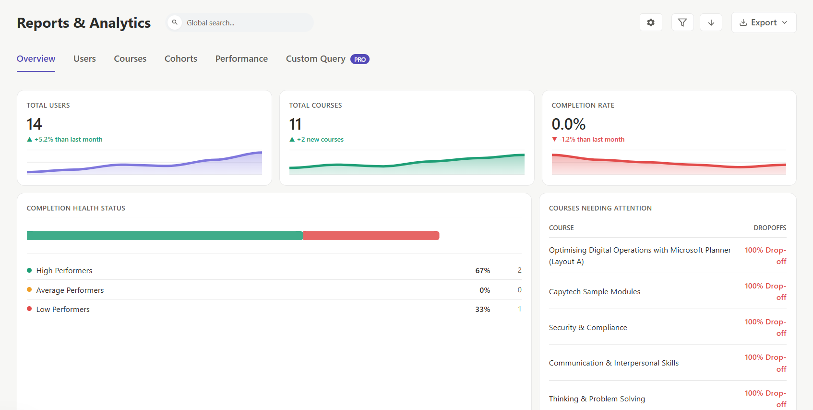
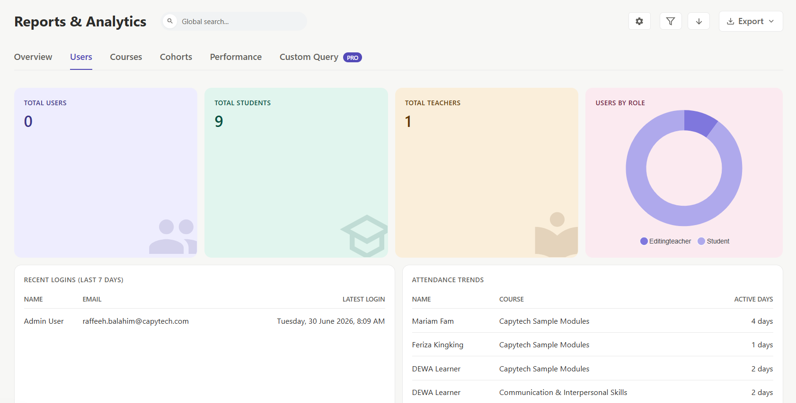
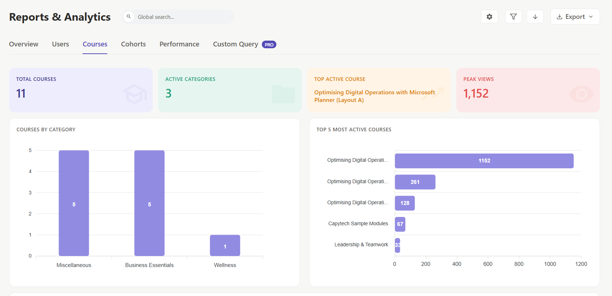
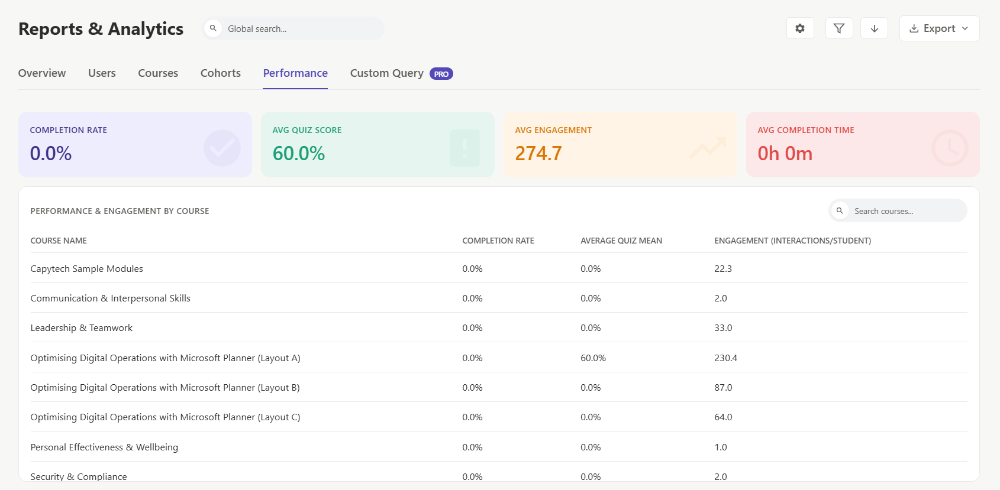

<h1 align="center">
  SURI - System User Reports and Insights
</h1>

<p align="center">
  <strong>A comprehensive, high-performance reporting and analytics dashboard for Moodle LMS.</strong>
</p>

<p align="center">
  
  
  
  
</p>

---

## 📖 Overview

**SURI (System User Reports and Insights)** is a powerful, modern, and lightning-fast analytics plugin designed specifically for Moodle. It transforms raw Moodle data into actionable insights through beautifully designed dashboards, interactive charts, and dense data tables.

Whether you are a Site Administrator tracking global platform health or a Teacher monitoring a specific cohort's engagement, SURI provides the tools you need without relying on external BI software.

---

## ✨ Key Features

- ⚡ **Lightning-Fast Navigation:** Built to feel like a Single Page Application (SPA). Navigate between heavy data tabs instantly without full page reloads.
- 🎯 **Performance Segmentation:** Automatically categorizes students into High, Average, and Low performers based on quiz grades.
- 🚨 **Anomaly Detection:** Automatically flags inactive users, dropping attendance, and courses that are struggling with low completion rates.
- 🔍 **Dynamic Filtering & Sorting:** A robust, stackable filtering system. Filter by department, institution, city, role, and course.
- 💾 **One-Click Exports:** Export any data table directly to CSV or PDF for offline analysis or stakeholder presentations.
- 👑 **Custom Query PRO:** A built-in safe SQL runner for Site Administrators to extract custom data sets without needing direct database access.

---

## ⚙️ Requirements

To run SURI at optimal performance, your server environment must meet the following specifications:
- **Moodle Version:** 5.0
- **PHP Version:** 8.2.12
- **Database:** MariaDB 10.11

---

## 📊 Dashboards and Charts Breakdown

SURI is divided into 6 main sections. Here is a comprehensive breakdown of every chart, table, and its specific function:

### 1. Overview Dashboard
*The birds-eye view of your LMS health and engagement.*
- **Total Users & Courses (Metrics & Sparklines):** High-level counts of active users and courses. Sparklines indicate recent historical growth and momentum.
- **Completion Rate (Metric & Sparkline):** Averages the course completion rates across the entire platform.
- **Completion Health Status (Stacked Bar Chart):** Categorizes the user base into High Performers (>=80%), Average (50-79%), and Low Performers (<50%) based on aggregated quiz scores.
- **Courses Needing Attention (Table):** Automatically flags courses that have high drop-off rates or low engagement, helping admins proactively identify problematic content.
- **Active Users Over Time (Area Chart):** A toggleable 7, 30, or 90-day trend chart showing daily active logins to gauge platform engagement over time.
- **Recent Flags (Table):** An anomaly detection feed that flags specific users who are falling behind or have been inactive past the configured threshold.
- **Engagement Breakdown (Donut Chart):** Visualizes the proportion of users based on their engagement tiers (Highly Engaged, Moderately Engaged, At-Risk, Inactive).

### 2. Users Tab
*Deep dive into user demographics, roles, and individual activity.*
- **Total Students & Teachers (Metrics):** Quick top-level counts separating the primary learning roles from instructional roles.
- **Users by Role (Donut Chart):** Visualizes the distribution of all assigned roles (e.g., student, teacher, manager) across the platform.
- **Recent Logins (Table):** Tracks exactly who logged into the system most recently (last 7 days).
- **Attendance Trends (Table):** Highlights your most active students based on the sheer number of days they have logged into the system.
- **Complete User Directory (Data Table):** A dense, searchable, and exportable table showing all users, their current enrollments, contact details, last access times, and any custom profile fields configured in Moodle.

### 3. Courses Tab
*Compare course effectiveness and instructional success.*
- **Top 5 Performing Courses (Bar Chart):** Ranks courses based on the highest average quiz scores achieved by their enrolled students.
- **Highest Drop-offs (Bar Chart):** Flags courses with the lowest ratio of completed students vs enrolled students (highest abandonment).
- **Most Active Courses (Bar Chart):** Ranks courses by the raw volume of recent user interactions and log events.
- **Course Directory (Data Table):** Comprehensive list of all courses, showing category, enrollment count, completion rate, average score, and time spent. 
- *(Clicking any course in this directory opens a dedicated **Course Detail View** with specific metrics for that single classroom).*

### 4. Cohorts Tab
*Track grouped users and organizational units.*
- **Cohort Performance (Radar Chart):** Compares multiple cohorts across various overlapping metrics (Average Score, Completion Rate, Activity Volume) on a single visual radar axis to easily spot strengths and weaknesses.
- **Cohort Directory (Data Table):** Lists all Moodle cohorts, their member counts, and aggregated performance metrics for the group as a whole.

### 5. Performance Tab
*Granular academic metrics and benchmarking.*
- **Grade Distribution (Histogram):** Shows the spread of all quiz grades across the platform (from 0 to 100) to identify the overall difficulty curve and grade inflation.
- **Module Progress (Line Chart):** Tracks the average completion pace of course modules over time.
- **Performance Benchmarks (Data Table):** Compares average completion time, average quiz scores, and drop-off rates side-by-side for all courses.

### 6. Custom Query PRO (Site Admins Only)
*For the power-users who need raw data access.*
- **SQL Runner Interface:** A secure interface to execute read-only custom SQL queries directly against the Moodle database.
- **Results Data Table:** Instantly renders the raw query output into a paginated, sortable, and CSV-exportable table, saving you from having to access phpMyAdmin.

---

## 🚀 Installation

### Method 1: Install from ZIP (Recommended)
1. Download the latest `suri.zip` release from this repository.
2. Log in to your Moodle site as a Site Administrator.
3. Navigate to **Site Administration** > **Plugins** > **Install plugins**.
4. Drag and drop the `suri.zip` file into the file picker and click **Install plugin from the ZIP file**.
5. Click **Upgrade Moodle database now** to register the plugin and its capabilities.

### Method 2: Manual Installation via Git
1. Clone this repository directly into your Moodle `report` directory:
   ```bash
   cd /path/to/your/moodle/report
   git clone https://github.com/yourusername/suri.git suri
   ```
2. Log in to your Moodle site as a Site Administrator.
3. Moodle will automatically detect the new plugin and prompt you to upgrade. Click **Upgrade Moodle database now**.

---

## 🛠️ Usage & Access

Depending on your role and permissions, SURI adapts its data scope.

**Global Access (Site Administrators):**
- Go to **Site Administration** > **Reports** > **SURI Report**.
- You will see unrestricted, platform-wide data.

**Course-Level Access (Teachers & Managers):**
- Navigate to any course where you have the Teacher/Manager role.
- In the course navigation menu, click the **Course Insights** link.
- SURI will open, pre-filtered to show analytics exclusively for that course.

---

## 🔒 Roles and Capabilities

SURI respects Moodle's capability system to ensure data privacy and security.

- `report/suri:view` - Allows a user (like a Teacher) to view SURI analytics scoped strictly to the users within their assigned courses.
- `report/suri:viewall` - Allows a user (like an Admin or Global Manager) to bypass course restrictions and view global analytics across the entire LMS.

*Note: The Custom Query PRO tab is hardcoded to only be accessible by users with the `moodle/site:config` capability (Site Administrators) for absolute security.*

---

## 📸 Screenshots

*(Add screenshots of your plugin here to make your README stand out!)*

- **Overview Dashboard:** 
- **Users Directory:** 
- **Courses Tab:** 
- **Performance Tab:** 

---

## 📝 License

This project is licensed under the [GNU General Public License v3.0](http://www.gnu.org/copyleft/gpl.html) - see the LICENSE file for details.
